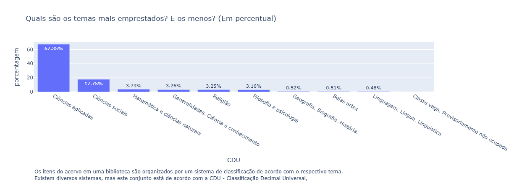

# Análise de empréstimos dos acervos do sistema de bibliotecas da UFRN

# Problema de negócio
A biblioteca universitária possui um vasto acervo de materiais informacionais (físicos e digitais), mas não possui clareza sobre como esses recursos estão sendo utilizados pelos diferentes perfis de usuários (alunos, professores, pesquisadores). A falta de visibilidade sobre padrões de uso, materiais subutilizados e demandas não atendidas dificulta a tomada de decisão sobre aquisição, descarte, organização e estratégias de incentivo ao uso.

Como analista de dados, o seu objetivo é:
é compreender o comportamento de uso dos materiais informacionais, identificar oportunidades para aumentar a eficiência e relevância do acervo e, assim, apoiar a instituição no objetivo de fomentar a produção de conhecimento.

# Contexto
Um dos objetivos de um sistema de bibliotecas universitárias é garantir o uso da informação para que seja produzido mais conhecimento. 

Nesse contexto, o Analista de Dados tem um papel fundamental para coletar, analisar e gerar insights afim de ajudar a instituição aprimorar a utilização dos materiais informacionais.

# Premissas de análise
1. A análise utilizou os dados públicos da [UFRN](https://dados.ufrn.br/dataset/emprestimos-acervos-das-bibliotecas) dos anos de 2010 a 2022.
2. Todos os valores dos registros do sistema dos exemplares foram removidos.
3. A análise considerou apenas os exemplares da UFRN.

# Estratégia da solução
O método de Análise Exploratória de Dados (EDA - Exploratory Data Analysis) foi usado para conduzir esse projeto.

Esse método consiste em um conjunto de técnicas estatísticas e de visualização que permitem compreender a estrutura do conjunto de dados, identificar padrões de comportamento, testar hipóteses iniciais e detectar anomalias ou inconsistências.

## Passo 1: Entendimento dos Dados
 - Análise descritiva Inicial - foi realizada uma análise descritiva com o objetivo de entender o tamanho, a estrutura, as colunas disponíveis e as estatísticas básicas dos dados, identificando padrões iniciais e possíveis inconsistências.
 - Descrição das colunas da Base de dados:
    - **id_emprestimo** - Identificador do empréstimo
    - **codigo_barras** - Código de barras do item do acervo
    - **data_renovacao** - Data da renovação do empréstimo.
    - **data_emprestimo** - Data da realização do empréstimo.
    - **data_devolucao** - Data da devolução do item
    - **matricula_ou_siape** - Matricula ou siape do usuário que realizou o
    empréstimo.
    - **tipo_vinculo_usuario** - Tipo do vínculo do usuário (servidor, discente,
    docente, etc.). 

## Passo 2: Tratamento Inicial
 - Limpeza de valores nulos e inconsistentes.
 - Classificação do arcevo da biblioteca (CDU).
 - Correção dos nomes dos níveis de ensino com ftfy.
 - Criação de um novo dataframe contendo os emprestimos e exemplares.
 - Criação de um novo dataframe contendo os emprestimos dos alunos de 2018 e 2019 de Graduação
 - Criação de um novo dataframe contendo os emprestimos dos alunos de 2018 e 2019 de Pós-Graduação

## Passo 3: Análise Descritiva
 - Quantidade total de exemplares emprestados analisada por ano, mostrando tendência (aumento, queda ou estabilidade) ao longo do tempo, por meio de gráfico de linhas.

 - Distribuição mensal dos empréstimos, identificando períodos de maior e menor demanda, com possibilidade de associar ao calendário acadêmico (férias, avaliações, etc.).

 - Contagem total de exemplares emprestados consolidada, útil para avaliar o volume geral de uso do acervo.

 - Identificação de meses com maior e menor número de empréstimos, apoiando decisões sobre gestão de recursos e planejamento de atividades internas da biblioteca.

## Passo 4: Análise Preditiva
 - Previsão de emprestimos para cursos de Graduação para o ano de 2023.
 - Previsão de emprestimos para cursos de Pós-Graduação para o ano de 2023.

## Passo 5: Hipóteses Análiticas
Hipótese 1 - A quantidade de empréstimos está aumentando ou diminuindo ao decorrer dos últimos anos?

Hipótese 2 - Em quais bibliotecas do sistema estão a maior quantidade de empréstimos?

**Siglas das Bibliotecas da UFRN:**
- **BCZM**: Biblioteca Central Zila Mamede,
- **BSEAJ**: Biblioteca Setorial Prof. Rodolfo Helinski - Escola Agrícola de Jundiaí - EAJ - Macaiba,
- **BSES**: Biblioteca Setorial Bertha Cruz Enders - Escola de Saúde da UFRN - ESUFRN,
- **BSCCS**: Biblioteca Setorial do Centro Ciências da Saúde - CCS,
- **BSDO**: Biblioteca Setorial Prof. Alberto Moreira Campos - Departamento de Odontologia,
- **BSCCET**: Biblioteca Setorial Prof. Ronaldo Xavier de Arruda - CCET,
- **BSCCHLA – CCHLA**: Biblioteca Setorial do Centro de Ciências Humanas, Letras e Artes - CCHLA,
- **BSEQ**: Biblioteca Setorial Prof. Horácio Nicolas Solimo - Engenharia Química - EQ - CT,
- **BSIQ**: Biblioteca Setorial Prof. Francisco Gurgel De Azevedo - Instituto Química - IQ,
- **BSCCSA – CCSA**: Biblioteca Setorial do Centro Ciências Sociais Aplicadas - CCSA,
- **BSDEART – DEART**: Biblioteca Setorial do Departamento de Artes - DEART,
- **BSDARQ**: Biblioteca Setorial Prof. Dr. Marcelo Bezerra de Melo Tinôco - DARQ - CT,
- **BSICE**: Biblioteca Setorial Árvore do Conhecimento - Instituto do Cérebro - ICe,
- **BSCE**: Biblioteca Setorial Moacyr de Góes - CE,
- **BSCB**: Biblioteca Setorial Prof. Leopoldo Nelson - Centro de Biociências - CB,
- **BSEMCM**: Biblioteca Setorial Dr. Paulo Bezerra - EMCM/RN - Caicó,
- **BSEMUFRN**: Biblioteca Setorial Pe. Jaime Diniz - Escola de Música - EMUFRN,
- **BSCERES**: Biblioteca Setorial Profª. Maria Lúcia da Costa Bezerra - CERES - Caicó,
- **BSFELCS**: Biblioteca Setorial Profª. Maria José Mamede Galvão - FELCS - Currais Novos,
- **BSNEI**: Biblioteca Setorial do Núcleo de Educação da Infância - NEI,
- **BSFACISA**: Biblioteca Setorial da Faculdade de Ciências da Saúde do Trairi - FACISA - Santa Cruz,
- **BSNESA – NESA**: Biblioteca Setorial do Núcleo de Ensino Superior do Agreste - NESA - Nova Cruz

Hipótese 3 - Quais são os temas mais emprestados? E os menos?

Hipótese 4 - Como se distribuem os empréstimos de exemplares pelos tipos de vínculo dos usuários?

Hipótese 5 - Quais coleções são mais emprestadas?

## Passo 5: Visualização
 - Criação de dashboard contendo métricas principais (Total de registros na base de dados, Tema mais emprestado, Biblioteca com maior arcevo, Coleção mais frequente,Tipo de vinculo de usuário que mais usa o arcevo), gráficos de linha para distribuição anual dos emprestimos durante os anos de 2010 a 2022.

<!-- 

## Visualize a análise completa:
[Dashboard](https://lookerstudio.google.com/reporting/9536ef1a-3c05-4347-b335-ae914e3c92d5)

# Próximos Passos
1. Explorar mais características ods clientes.
2. Automatizar a coleta e a análise para acompanhamento.
3. Agrupar os clientes em grupos de maior e menor faturamento para entender se há similaridades ou não.
4. Montar um dashboard de acompanhamento das métricas das futuras campanhas de marketing. -->